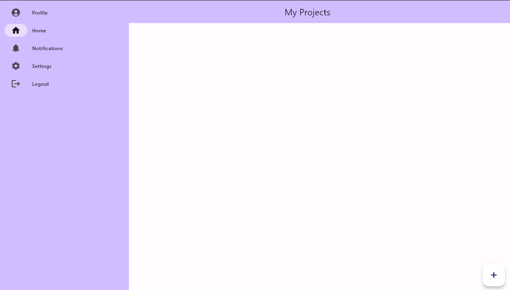
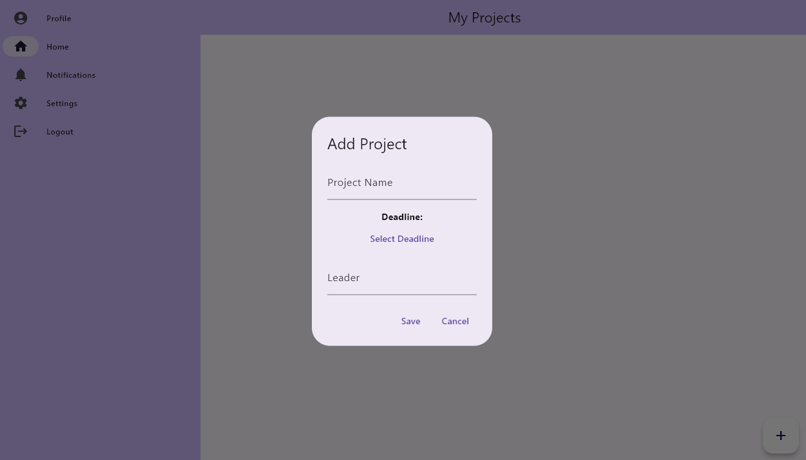
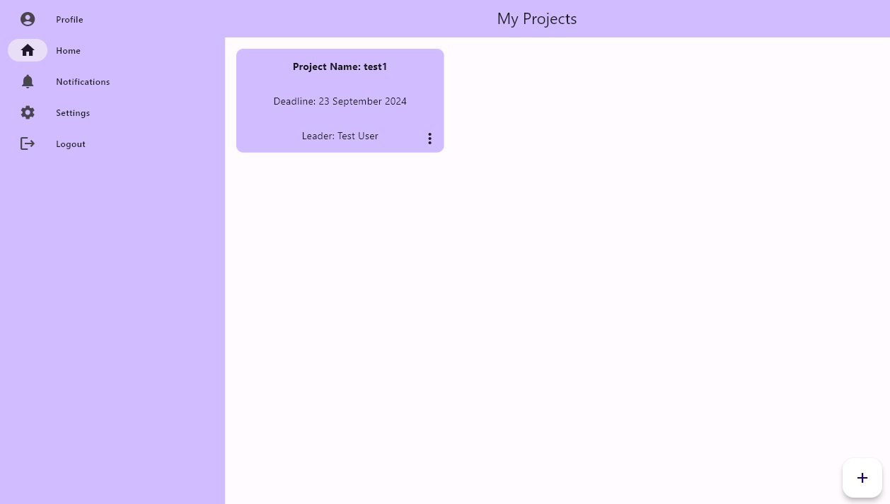
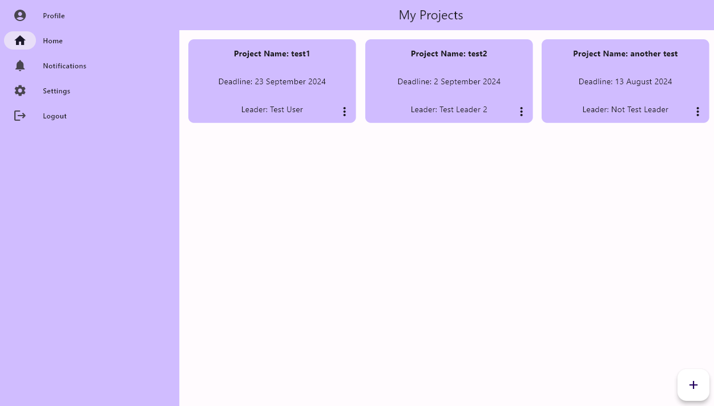
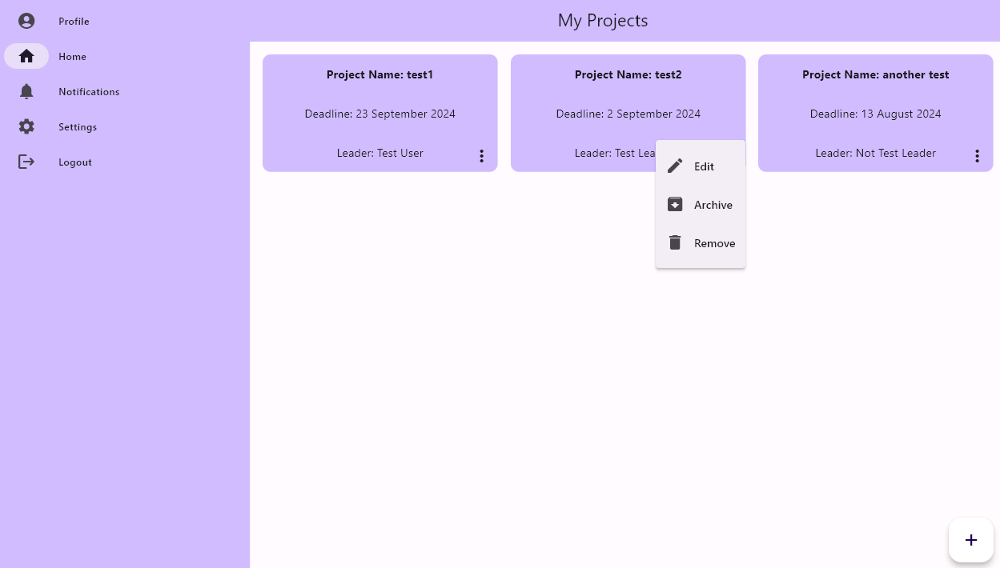
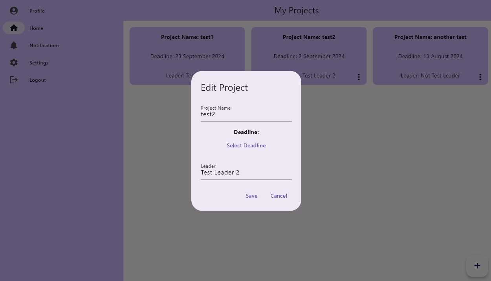
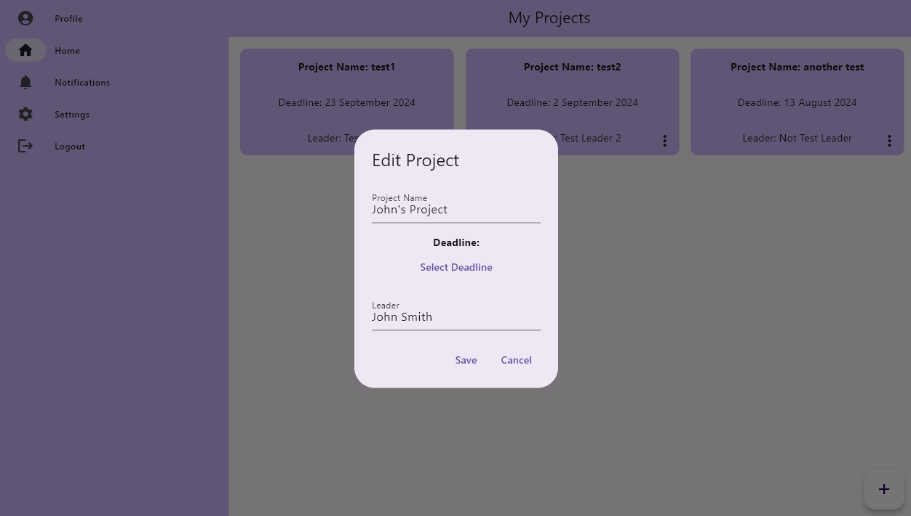
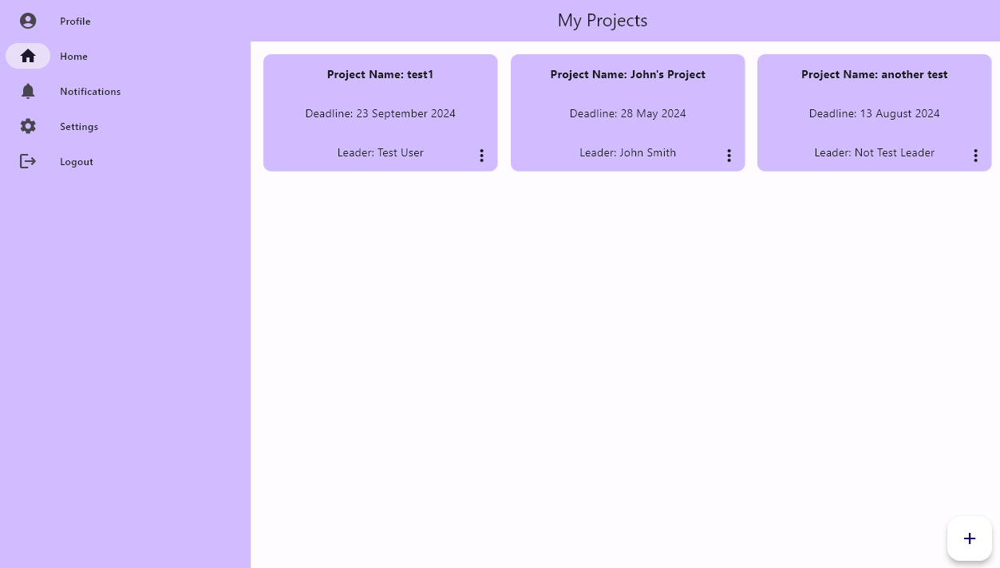
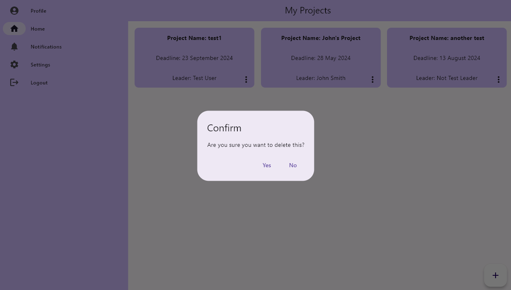
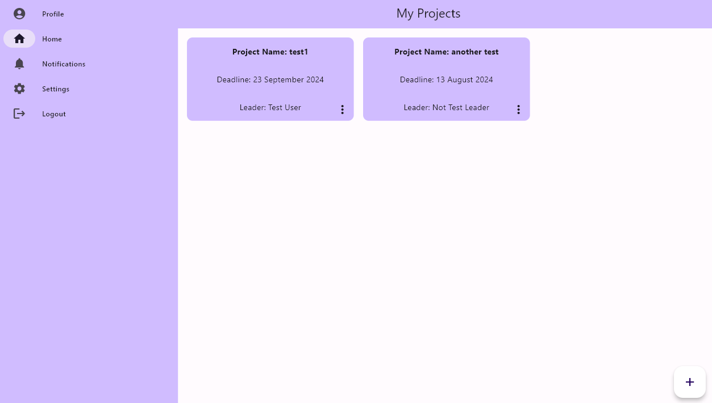

Be able to manage multiple projects at once
===========================================

Users will be able to create new projects (see A).
--------------------------------------------------

Initially, the project page will have no projects, the user can click the "+" button to create a new project. 
This will open a modal where the user can enter the project title, deadline, and team leader. 

Once the user enters the desired details of the project, they can click the "Create" button to create the project. The project will then be displayed on the project page.

Users will be able to view multiple assigned projects at any one time.
-----------------------------------------------------------------------

As the user creates more projects, they will be displayed on the project page.

Users will be able to change the name and deadline of a project.
----------------------------------------------------------------

Each project has a dropdown menu that can be accessed by clicking the three dots on the right side of the project widget.
This will open a dropdown menu with the options to edit the project.
Selecting the "Edit" option will open a modal where the user can change the project title and deadline.

Once the user has made the desired changes, they can click the "Save" button to save the changes.

This will update the project widget on the project page and the database with the new details.

Users will be able to delete projects.
---------------------------------------

Once the delete option is selected, a modal will open asking the user to confirm the deletion of the project.

Selecting the "Yes" option will delete the project from the project page and database.

Projects will have a title (string), deadline (date), description (string), and list of team members (see C) (list).
--------------------------------------------------------------------------------------------------------------------

This can be seen above when creating the project, the user can enter the project title, deadline, and team leader and edit these at any time.

Consequences or side-effects: 
-----------------------------

- If a user has too many projects, it could cause the application to slow down on the projects page due to the number of widgets being displayed to them.

- Storing more projects on our servers would cost more money as we store more data.