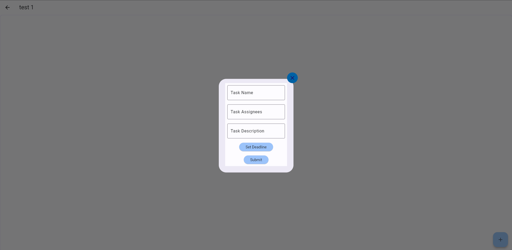

Requirement 2: Be able to manage multiple tasks within projects
=================================================================

Tasks (see B) will have a title (string), deadline (date), description (string), none or many assignees to that task and store zero or many tickets.
----------------------------------------------------------------------------------------------------------------------------------------------------

After opening a project from the projects page, the user will be able to see all the tasks that are associated with that project.

From here the user can create a new task by clicking the "Create Task" button. This will open a modal where the user can enter the title, deadline, description and assignees for the task.

None of these fields are required. Once a task is created, the user will be brough back to the task screen where they can see the new task.

Users will be able to create new tasks.
-------------------------------------------------

This can be seen above where the user is able to create a new task. The user will be able to see all the tasks that are associated with that project.

Users will be able to change the title, deadline, description and assignees.
--------------------------------------------------------------------------------------

Once a task has been created, the user can click the 3 dots on the right side of the task to open a dropdown menu. From here the user can click "Edit Task" to open the task edit modal.

Consequences or side-effects: 
-----------------------------

- If a user has too many tasks, it could cause the application to slow down on the projects page due to the number of widgets being displayed to them

- Storing tasks on our servers may cost more money as we store more data