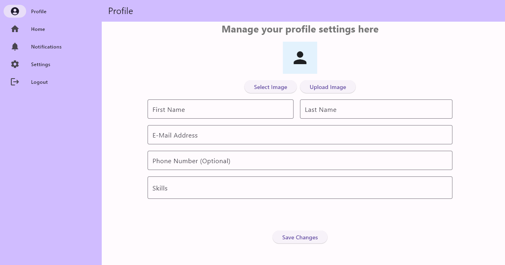
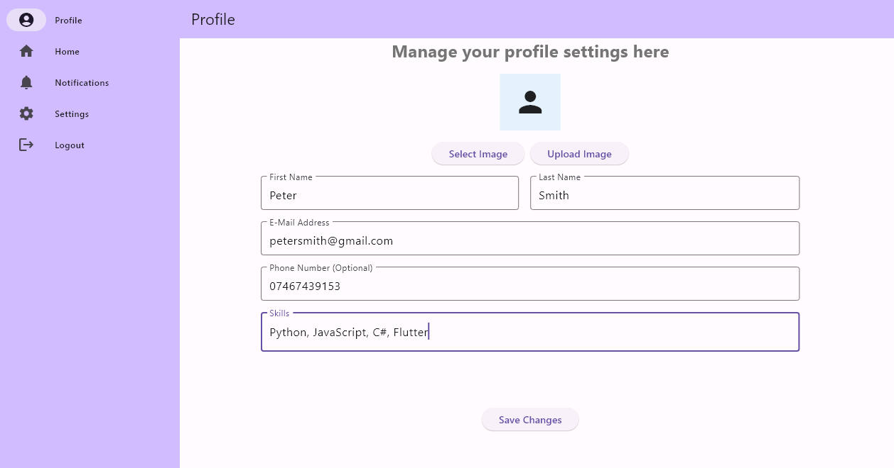
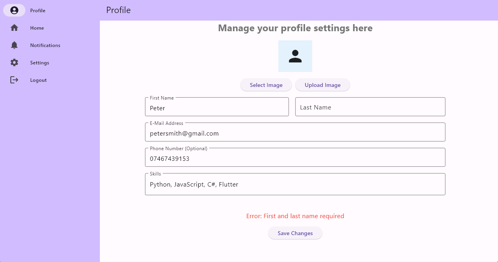
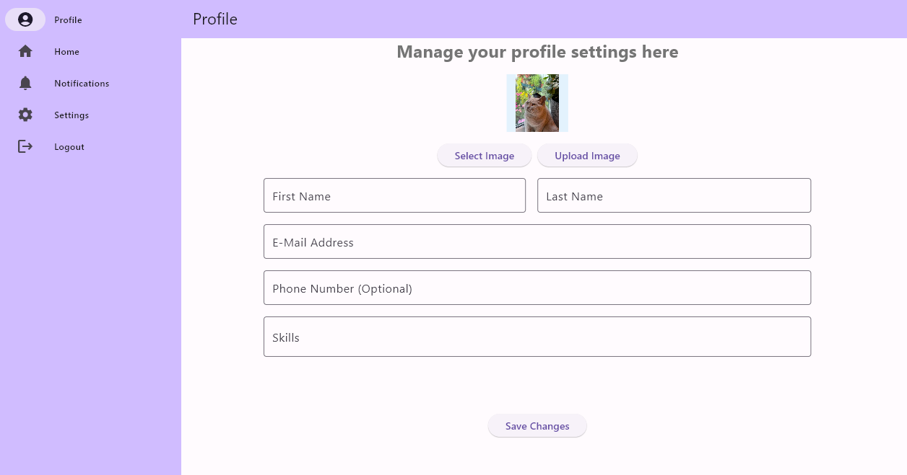

Be able to manage user profiles within the application
======================================================

Users (see C) will have a first name (string), last name (string), email (string), and skills (optional string) associated with them.
--------------------------------------------------------------------------------------------------------------------------------------

Upon account creation, team member will have an email and name associated with them.

Once they visit the profile screen through the sidebar the user will be able to optionally add skills.

After inputting the new information, the user will be able to save the changes. If the user's inputs are valid, this will update the information in the database. 
Otherwise feedback will be given to the user.

Users will be able to optionally store phone number (float) and profile picture (image).
-----------------------------------------------------------------------------------------------

Storing a phone number can be seen above. The user will be able to input a phone number on the profile screen and save it to the database.
Storing a profile picture is a little different. On the profile screen the user will be able to select an image from their device's file system. Once selected, the image will be displayed on the screen.

The user will then be able to upload the image to the database with the designated button (The upload button must be used otherwise the image will not be saved).

Users will be able to view stored data.
----------------------------------------------

Users will be able to change stored data upon visiting the profile page.
-------------------------------------------------------------------------------

As seen above, the user will be able to change their name, email, skills, profile picture, and phone number through the profile screen.
The user's password can also be reset by logging out and clicking the "reset password" button on the login screen.

Consequences or side-effects: 
-----------------------------

- Storing user information creates a risk of breaching data protection laws.