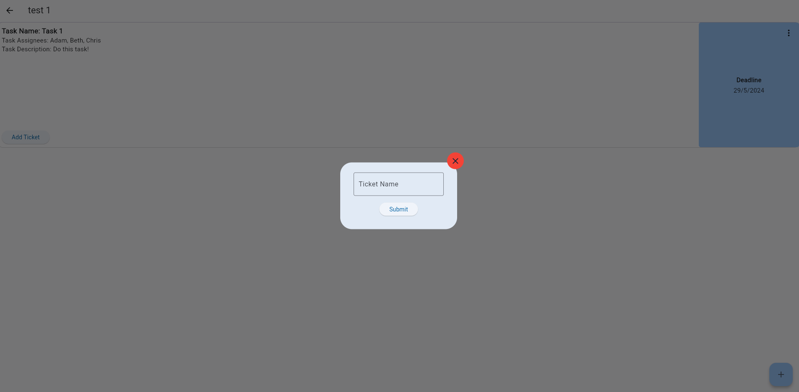

Be able to assign tickets to tasks
==================================

Users who are assigned to a task are able to create tickets (see D) for this task.
--------------------------------------------------------------------------------------------

After creating a task, the user will be able to click on each task on the tasks screen to expand it and view the task description

The user will then be able to click on the "Create Ticket" button to create a ticket for the task. 
This will open a modal where the user can enter the ticket name before submitting it.

After a ticket is created, it will be displayed on the task screen under the task description.

Any number of tickets can be created for a task.

Tickets can be viewed and worked on by anyone who has access to view the task.
------------------------------------------------------------------------------

When a ticket is created, it will be displayed on the task screen under the task description until it is resolved.

Consequences or side-effects: 
-----------------------------

- Tickets notify the user whenever they are updated, this means that it could result in assignees being spammed with notifications.