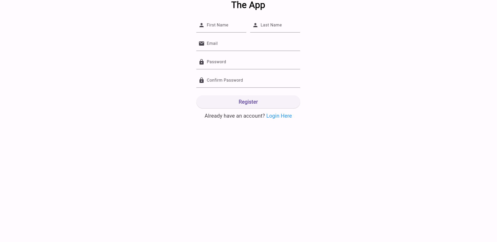
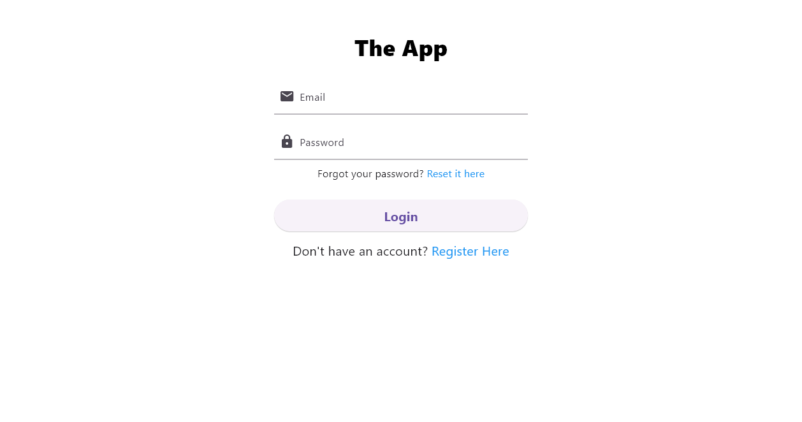
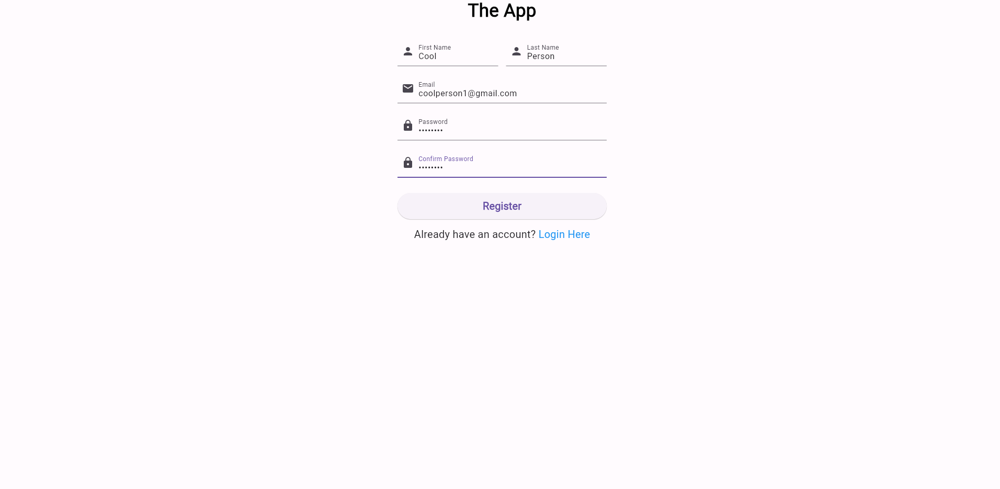

Be able to manage user accounts
===============================

Accounts will be made up of first name (string), last name (string), email address (string) and password (string).
-------------------------------------------------------------------------------------------------------------------

When creating an account, the user will be prompted to enter their first name, last name, email address and password.

Users will be able to create new accounts
------------------------------------------

When first launching the application, the user will be greeted with the login page, where they will have the option to create a new account.

Upon clicking the "Create Account" button, the user will be directed to the account creation page where they will be prompted to enter their 
first name, last name, email address and password. 

Once all fields have been filled out, the user will then click the "Create Account" button to submit the information. 

If the account creation is successful, the user will be allowed to login with their given details.

Users will be able to access the app using previously created account email and password
------------------------------------------------------------------------------------------

After an account has been created, it will be stored in the cloud database (Firebase) and can be accessed from any device with an internet connection.

Users will be able to change profile data related to their account in app
--------------------------------------------------------------------------

Upon visiting the profile page after logging in, the user will be able to change all of their account details.

Consequences or side-effects:
-----------------------------

- The user may not want their data stored due to not knowing what may be done with it, resulting in potential law implications.

- If unauthorised access were to occur, we would be held responsible, and enforcing user security can be costly/difficult.

- Storing user data can get expensive despite the cost-friendly options Firebase provides.